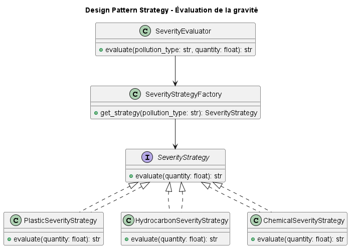
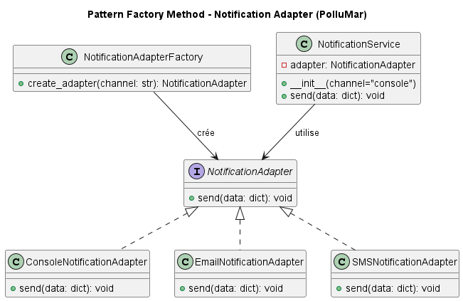
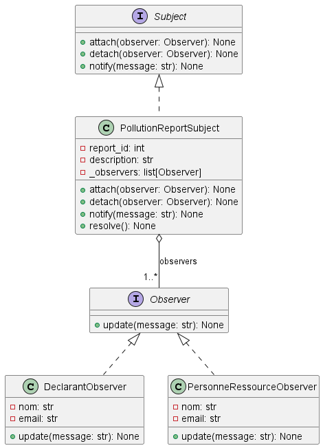
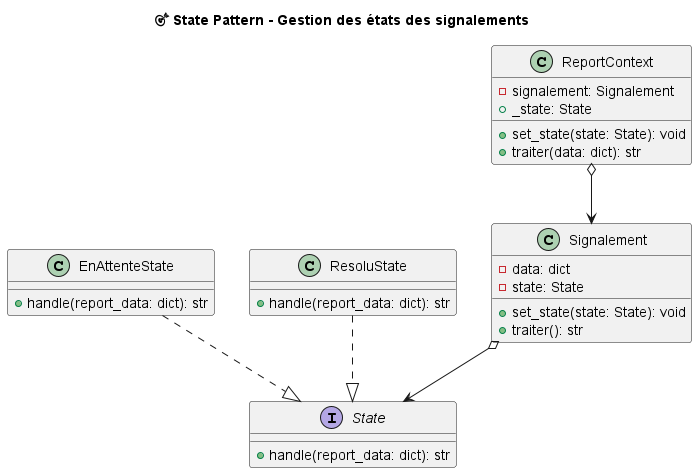
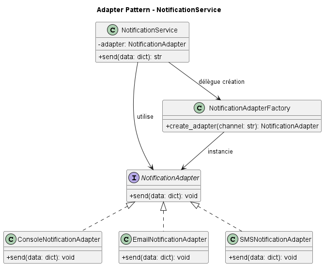
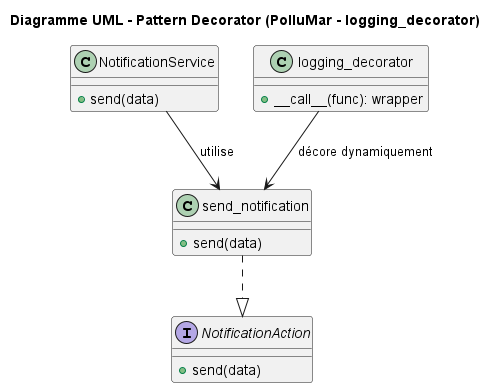
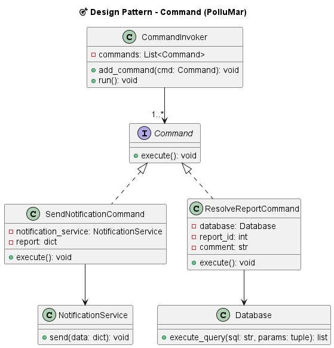
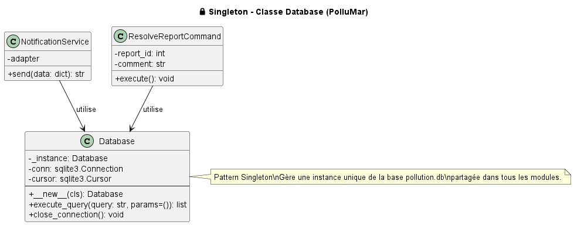

# 🐳 PolluMar – Application de Signalement de Pollution Maritime

PolluMar est une application Web permettant de signaler, évaluer et suivre les incidents de pollution maritime. Ce projet a été développé dans le cadre du cours **IFT785 - Approches orientées objets** à l’Université de Sherbrooke.

---

## 🌊 Fonctionnalités principales

- 📝 Soumission de signalements via formulaire
- 🧠 Évaluation automatique de la gravité d’un incident
- 📬 Notification simulée via console, email ou journal
- 📾 Historique et statut des signalements (en attente, résolu)
- 🤪 Tests : unitaires, d’intégration, end-to-end
- 🧹 Intégration de plusieurs **patrons de conception (Design Patterns)**

---

## 🚀 Lancement de l’application

```bash
cd Projet_final/PolluMar
python -m app
```

---

## 🧱 Architecture du projet

L’application suit une architecture **MVC modulaire** :


 ```
 📆app/
 ├📂models/                 # Base de données et entités
 ├📂services/               # Logique métier, stratégie, états, observateurs
 ├📂utilities
 ├📂views/                  # Routes Flask
 ├📂templates/              # Fichiers HTML avec Jinja2
 ├📂uml_patterns            # imges de l'implementation des design patterns
 📂tests/                  # Séparés en unitaires, intégration, e2e
```

---

## 🎯 Patrons de conception utilisés

### 1. 🎯 Strategy Pattern – Gravité de Pollution

- ⚙️ Permet d'évaluer dynamiquement la gravité d’un incident selon son type.
- 🧹 Classes :
  - `SeverityStrategy` (interface)
  - `PlasticSeverityStrategy`, `HydrocarbonSeverityStrategy`, `ChemicalSeverityStrategy`
  - `SeverityStrategyFactory`, `SeverityEvaluator`
- 📌 

---

### 2. 🏣 Factory Method – Notification adaptable

- 📨 Permet de choisir dynamiquement un adaptateur selon le type de notification.
- 🧹 Classes :
  - `NotificationAdapter` (interface)
  - `ConsoleNotificationAdapter`, `EmailNotificationAdapter`, `SMSNotificationAdapter`
  - `NotificationAdapterFactory`, `NotificationService`
- 📌 

---

### 3. 🔔 Observer Pattern – Notification multiple

- 📣 Notifie automatiquement plusieurs observateurs quand un signalement est modifié.
- 🧹 Observateurs : `ConsoleObserver`, `EmailObserver`, `AuditObserver`
- 🧹 Sujet : `PollutionReportSubject`
- 🧹 Interfaces : `Observer`, `Subject`
- 🧹 Regroupement : `IncidentObservers`
- 📌 

---

### 4. 🔄 State Pattern – État dynamique d’un signalement

- 🔁 Permet à un signalement de changer dynamiquement de comportement en fonction de son état.
- 🧹 États : `EnAttenteState`, `ResoluState`
- 🧹 Contexte : `Signalement`
- 📌 

---

### 5. 🧩 Adapter Pattern – Uniformisation des canaux de notification

- 🔌 Permet d’unifier l’interface des canaux (console, email, SMS).
- 🧹 Interfaces : `NotificationAdapter`
- 🧹 Adaptateurs : `ConsoleNotificationAdapter`, `EmailNotificationAdapter`, `SMSNotificationAdapter`
- 📌 

---

### 6. 🪶 Decorator Pattern – Journalisation d’exécution

- ➕ Ajoute dynamiquement un comportement de **logging** sans modifier les fonctions existantes.
- 🧹 Élément principal : `logging_decorator`
- 📌 

---

### 7. 🧠 Command Pattern – Encapsulation d’actions (send/resolve)

- ⏯️ Encapsule les actions comme des objets commandes exécutables.
- 🧹 Commandes : `SendNotificationCommand`, `ResolveReportCommand`
- 🧹 Interface : `Command`
- 🧹 Exécutant : `CommandInvoker`
- 📌 

---

### 8. 🗃️ Singleton Pattern – Connexion unique à la base de données

- 🔒 Assure qu’une seule instance de la classe `Database` soit utilisée dans tout le projet.
- 🧹 Classe : `Database`
- 📌 


---
## 🤪 Couverture des tests

| Type de test       | Couverture | Exemples |
|--------------------|------------|----------|
| ✅ Unitaire         | ✅ 100% pour les State, Strategy, Observer |
| ✅ Intégration      | ✅ Routes + Factory + Observers |
| ✅ End-to-End (E2E) | ✅ Scénarios complets (AJAX → DB → Notification) |
| 📊 Couverture globale | **65 %**  |

---

## 🛠️ Technologies utilisées

- Python 3.11, Flask
- SQLite
- Jinja2 (templates)
- Pytest + Coverage
- Git + GitHub (workflow GitFlow)
- PlantUML pour les diagrammes UML

---

## 📚 Auteurs

- **Sabala Herman** – Université de Sherbrooke – IFT785


---


---

### 5.  Decorator Pattern – Journalisation d’exécution

-  Permet d’ajouter dynamiquement un comportement de **logging** sans modifier les fonctions existantes.
-  Appliqué notamment sur `NotificationService.send()` pour tracer les appels et retours.
-  Élément principal : `logging_decorator`
-  


##  Couverture des tests

| Type de test       | Couverture | Exemples |
|--------------------|------------|----------|
| ✅ Unitaire         | ✅ 100% pour State, Strategy, Observer, Decorator |
| ✅ Intégration      | ✅ Routes + Factory + Observers + Decorator |
| ✅ End-to-End (E2E) | ✅ Scénarios complets (AJAX → DB → Notification) |
| 📊 Couverture globale | **65 %**  |

---

##  Technologies utilisées

- Python 3.11, Flask
- SQLite
- Jinja2 (templates)
- Pytest + Coverage
- Git + GitHub (workflow GitFlow)
- PlantUML pour les diagrammes UML

---

##  Auteurs

- **Sabala Herman** – Université de Sherbrooke – IFT785
